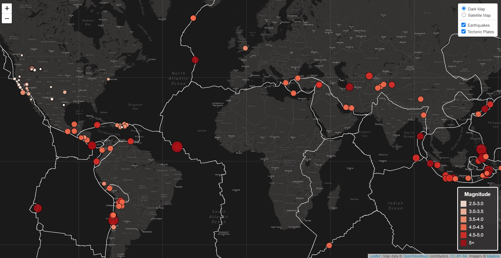

# leaflet-challenge

## Background

Earthquakes across the globe w/ magnitudes of 2.5+ in the last 7 days have been plotted on a map using leaflet.js. Color and size of the bubble represents the magnitude. Background layers can be toggled between a dark map and a satellite map and earthquakes and tectonic plates can be turned on or off. Hover over an earthquake to show a tooltip that provides magnitude and location.

## Data Sources

https://earthquake.usgs.gov/earthquakes/feed/v1.0/summary/2.5_week.geojson
https://raw.githubusercontent.com/fraxen/tectonicplates/master/GeoJSON/PB2002_plates.json